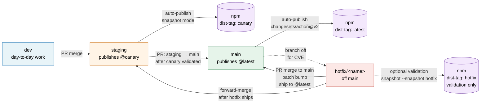

# Release process

This directory documents the release engineering process for the
`package-template` monorepo.

## Documents

| Document                                                       | Audience                            | When to read                                                                                 |
| -------------------------------------------------------------- | ----------------------------------- | -------------------------------------------------------------------------------------------- |
| [`overview.md`](./overview.md)                                 | Anyone                              | First. Read this to understand the model.                                                    |
| [`canary-on-staging.md`](./canary-on-staging.md)               | Day-to-day contributors             | When you open or merge a PR against `staging`.                                               |
| [`stable-on-main.md`](./stable-on-main.md)                     | Release engineers                   | When you ship a release from `main`.                                                         |
| [`trusted-publishing-setup.md`](./trusted-publishing-setup.md) | First-time setup, post-`pnpm setup` | When configuring npm Trusted Publishing.                                                     |
| [`incident-response.md`](./incident-response.md)               | On-call                             | When a release fails or a bad release ships.                                                 |
| [`hotfix-on-main.md`](./hotfix-on-main.md)                     | Release engineers, security team    | When shipping a patch-level fix that bypasses staging for a CVE or production-impacting bug. |
| [`back-merge.md`](./back-merge.md)                             | Release engineers                   | After a hotfix lands on `main`: bring the fix to `staging` without double-bumping.           |

## Process summary

1. Contributors open PRs against `dev`.
2. PRs are merged into `staging`, which auto publishes a canary to the
   `canary` npm dist-tag on every merge.
3. The release engineer validates the canary, then opens a PR from
   `staging` into `main`.
4. Merging into `main` publishes a stable release to the `latest` npm
   dist-tag.

**Exception**: production-impacting bugs and security CVEs may bypass the
`staging → main` flow via the hotfix process documented in
[`hotfix-on-main.md`](./hotfix-on-main.md). Hotfixes are patch-level only
and ship directly to `@latest`.

## Release flow diagram

Both publish paths use npm Trusted Publishing (OIDC). No `NPM_TOKEN`
secret is required.

## See also

- [`CLAUDE.md`](../../../CLAUDE.md): branching strategy and contributor
  guidelines.
- [`CONTRIBUTING.md`](../../../CONTRIBUTING.md): workflow conventions.
- [Changesets documentation](https://changesets.dev): versioning tool.
- [npm Trusted Publishers](https://docs.npmjs.com/trusted-publishers/).
  OIDC authentication mechanism.
