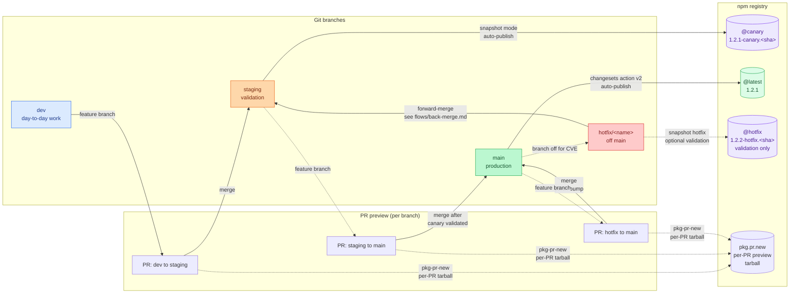

# Release process

This directory documents the release engineering process for the
`package-template` monorepo. It's the entry point for new maintainers
and contributors who need to understand how a code change becomes a
published artifact on npm.

## The model in one paragraph

We publish to npm through two **dist-tags** driven by two **protected
branches**:

- `staging` publishes a **canary** to the npm dist-tag `canary`.
- `main` publishes a **stable** to the npm dist-tag `latest`.

Both branches use the same Changesets workflow, the same GitHub Actions
file (`.github/workflows/release.yml`), and the same npm Trusted
Publishing (OIDC) configuration. The only difference is which
dist-tag the publish targets and which mode Changesets runs in
(`--snapshot canary` for canary, normal mode for stable).

## Branches

| Branch    | Role              | Publishes to | Changesets mode             |
| --------- | ----------------- | ------------ | --------------------------- |
| `dev`     | Day-to-day work   | (nothing)    | (nothing)                   |
| `staging` | Release candidate | `canary` tag | `version --snapshot canary` |
| `main`    | Production        | `latest` tag | `version` (normal)          |

The promotion flow is `dev → staging → main`. `dev` is unrestricted;
`staging` and `main` are branch-protected and accept merges only via
PR.

## Why two branches, not one

A single branch publishing on every merge makes the "is this safe to
ship?" question hard to answer. With two branches, the question is
localized:

- Every PR merged on `staging` produces a tagged, installable canary
  artifact within minutes. Smoke tests, contract tests, and downstream
  consumers can pin `@canary` to validate integrations.
- Promotion to `main` is a deliberate human action, opening and
  merging the `staging → main` PR. That merge publishes the same
  artifacts under `@latest`, with the same Changesets having been
  consumed on `main` for a real semver bump.

The cost of the second branch is one PR per release. The benefit is
that "latest" always means "passed staging", and "canary" always
means "currently being validated."

## Why Trusted Publishing

Trusted Publishing replaces long-lived `NPM_TOKEN` secrets with
short-lived OIDC tokens issued by GitHub Actions at job time. Two
practical benefits:

- **No secrets to rotate.** The OIDC token is minted, used, and
  discarded within the publish job. There is no `NPM_TOKEN` in the
  repository's secrets list.
- **Provenance by default.** npm attaches a signed provenance
  attestation to every published tarball, attesting that the build
  was produced by this repository's CI on this commit.

Trade-off: npm allows only **one trusted publisher per package**. This
is why both branches publish through the same workflow file
(`release.yml`).

## Documents

The docs are grouped into three subfolders:

- **`flows/`** — how a release moves through the pipeline (canary,
  stable, hotfix, back-merge, pr-preview).
- **`channels/`** — where a published release lands (github-releases,
  github-packages, trusted-publishing-setup, incident-response).
- **`policies/`** — governance and operational rules (versioning,
  governance, rollback).

| Document                                                                         | Audience                            | When to read                                                                                                                        |
| -------------------------------------------------------------------------------- | ----------------------------------- | ----------------------------------------------------------------------------------------------------------------------------------- |
| [`flows/canary-on-staging.md`](./flows/canary-on-staging.md)                     | Day-to-day contributors             | When you open or merge a PR against `staging`.                                                                                      |
| [`flows/stable-on-main.md`](./flows/stable-on-main.md)                           | Release engineers                   | When you ship a release from `main`.                                                                                                |
| [`flows/hotfix-on-main.md`](./flows/hotfix-on-main.md)                           | Release engineers, security team    | When shipping a patch-level fix that bypasses staging for a CVE or production-impacting bug.                                        |
| [`flows/back-merge.md`](./flows/back-merge.md)                                   | Release engineers                   | After a hotfix lands on `main`: bring the fix to `staging` without double-bumping.                                                  |
| [`flows/pr-preview.md`](./flows/pr-preview.md)                                   | Anyone reviewing a PR               | When you want to install a build from a PR to review or smoke-test it before merge.                                                 |
| [`channels/trusted-publishing-setup.md`](./channels/trusted-publishing-setup.md) | First-time setup, post-`pnpm setup` | When configuring npm Trusted Publishing.                                                                                            |
| [`channels/incident-response.md`](./channels/incident-response.md)               | On-call                             | When a release fails or a bad release ships.                                                                                        |
| [`channels/github-releases.md`](./channels/github-releases.md)                   | Release engineers, contributors     | When you want to understand which publish channels create a GitHub Release, and how `changesets/action` generates the release body. |
| [`channels/github-packages.md`](./channels/github-packages.md)                   | Release engineers                   | When you want to publish to GitHub Packages in addition to npm, and how the dual-publish architecture works.                        |
| [`policies/versioning.md`](./policies/versioning.md)                             | Release engineers, contributors     | When you are unsure what semver bump to use, or when shipping a breaking change or deprecation.                                     |
| [`policies/governance.md`](./policies/governance.md)                             | Maintainers                         | When you need to know who can push which branch, or how to update branch protection rules.                                          |
| [`policies/rollback.md`](./policies/rollback.md)                                 | Release engineers, on-call          | When a release to `@latest` is broken or unsafe, and consumers need to be steered away from it.                                     |

## Process summary

1. Contributors open PRs against `dev`.
2. PRs are merged into `staging`, which auto publishes a canary to the
   `canary` npm dist-tag on every merge.
3. The release engineer validates the canary, then opens a PR from
   `staging` into `main`.
4. Merging into `main` publishes a stable release to the `latest` npm
   dist-tag.

**Exception**: production-impacting bugs and security CVEs may bypass
the `staging → main` flow via the hotfix process documented in
[`flows/hotfix-on-main.md`](./flows/hotfix-on-main.md). Hotfixes are
patch-level only and ship directly to `@latest`.

## Release flow diagram

Both publish paths use npm Trusted Publishing (OIDC). No `NPM_TOKEN`
secret is required.

## Glossary

- **Canary**: a pre-release build published to the npm dist-tag
  `canary`. Identified by a version like `1.2.1-canary.a1b2c3d`
  (tag + 7-char commit SHA).
- **Stable**: a production release published to the npm dist-tag
  `latest`. Identified by a plain semver version like `1.2.1`.
- **Dist-tag**: a pointer on the npm registry that maps a label
  (`canary`, `latest`, `next`, ...) to a specific version. `npm
install pkg@canary` resolves through this mapping.
- **Snapshot release**: a Changesets mode
  (`changeset version --snapshot <tag>`) that produces a pre-release
  version without consuming the changeset files. Used for the canary
  path.
- **Trusted Publishing**: npm's OIDC-based authentication mechanism
  for CI. Replaces `NPM_TOKEN` secrets.
- **OIDC**: OpenID Connect. The protocol GitHub Actions uses to mint
  short-lived identity tokens that npm validates before publishing.

## See also

- [`CLAUDE.md`](../../../CLAUDE.md): branching strategy and contributor
  guidelines.
- [`CONTRIBUTING.md`](../../../CONTRIBUTING.md): workflow conventions.
- [Changesets documentation](https://changesets.dev): versioning tool.
- [npm Trusted Publishers](https://docs.npmjs.com/trusted-publishers/).
  OIDC authentication mechanism.
